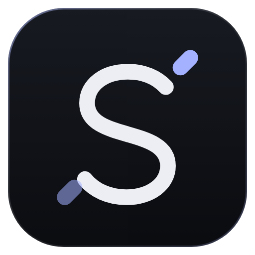
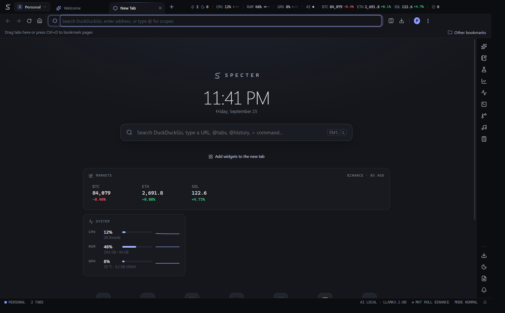
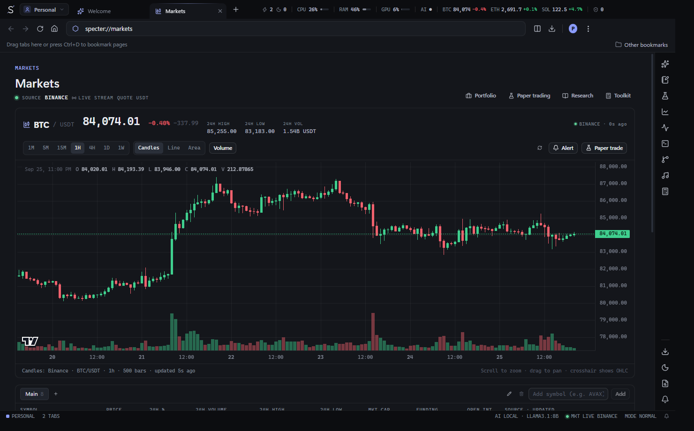
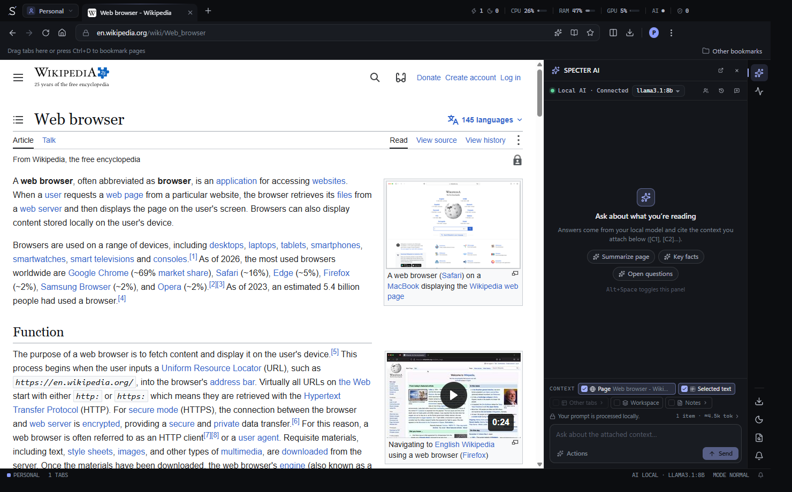
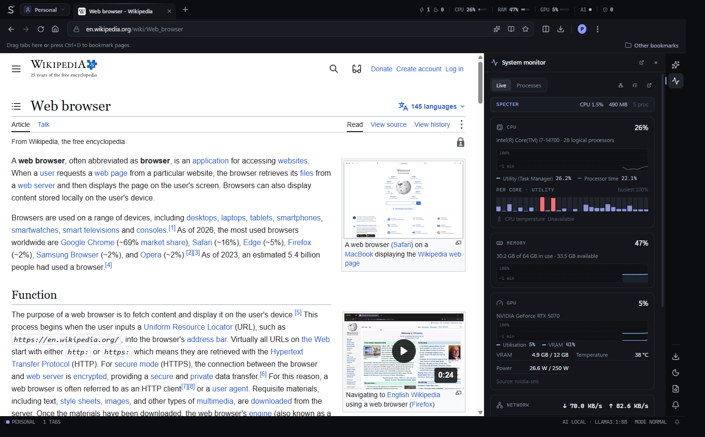
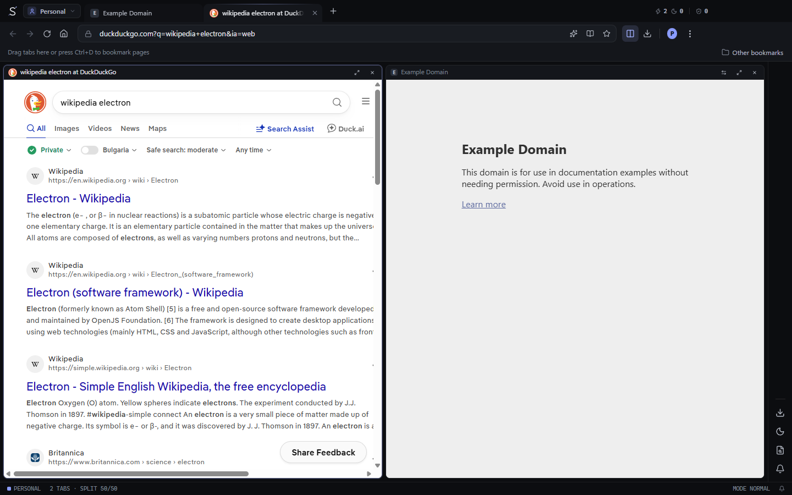
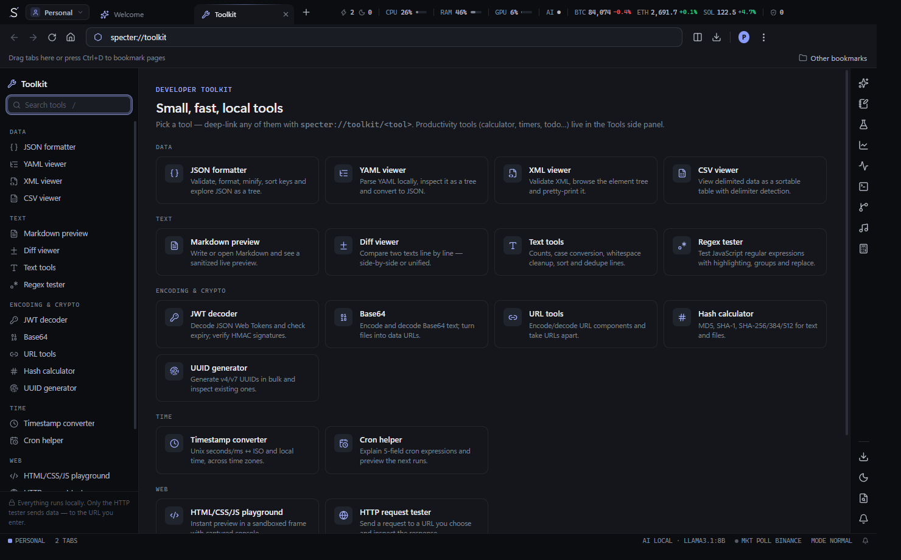
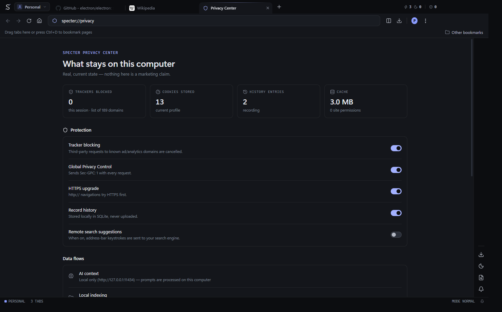

<p align="center">
  
</p>

<h1 align="center">SPECTER</h1>
<p align="center"><b>The Power Browser.</b> A Chromium desktop browser for everyday use — with a local-first toolkit for research, development, AI, markets and system monitoring built in.</p>

<p align="center">
  
</p>

## What is SPECTER?

SPECTER is a full desktop browser (Electron 44 · Chromium 152) that you can use as your daily browser. The browser comes first: tabs, workspaces, history, bookmarks, downloads, profiles, permissions, DevTools and session restore all work like you'd expect. On top of that, SPECTER adds optional power tools that run **locally** and **for free** — no accounts, no API keys, no telemetry.

The title bar doubles as an instrument panel: live CPU / RAM / GPU, local-AI status, a market ticker, tabs awake vs. sleeping and trackers blocked — all measured, never estimated.

## Features

### Browser (tier 1)
- Custom chrome: tab strip with **pinned tabs, tab groups** (names, colours, collapse), drag-reorder, tear-off to new window, hover previews with live memory, tab notes, temporary tabs
- **Omnibox** that understands URLs, searches and scopes — `@tabs`, `@history`, `@bookmarks`, `@ws`, `@cmd` / `>`, `@ai` / `?`, `@notes`, `$BTC` — with inline autocomplete, math (`2*(3+4)`) and unit conversion (`10 km to mi`)
- History with full-text search (SQLite FTS5), date/domain/workspace filters and range deletion
- Bookmarks with folders, tags, drag & drop, workspace links, bookmarks bar, HTML import/export
- Download manager (pause/resume/retry, speed, ETA, open/show in folder)
- Per-site permissions (camera, mic, location, notifications, clipboard, screen capture, pop-ups, cookies, JavaScript)
- **Profiles** with isolated cookies, storage, history, bookmarks and workspaces
- Docked or detached **Chromium DevTools**, find in page with **regex & whole-word**, reader mode with text-to-speech, built-in PDF viewer, full-page screenshots, print, save page
- Session restore (lazy — only visible tabs load), crash recovery, reopen closed tabs
- Import bookmarks & history from **Chrome, Edge, Brave, Vivaldi, Opera and Firefox**
- Fully customisable keyboard shortcuts that also work inside web pages

### SPECTER core (tier 2)
- **Command palette** (`Ctrl+K`) — every feature is a command (170 in the palette)
- **Workspaces** (`Ctrl+Shift+W`) with snapshots, compare, export (JSON / Markdown / HTML)
- **Split view**: 50/50, 33/67, 67/33, 25/75, rows, three-column, quadrant, four-panel, draggable splitters, saved layouts
- **Tab sleeping** with a lifecycle (active → background → idle → sleeping) and a dashboard showing memory actually released
- 7 themes (SPECTER Dark, Obsidian, Midnight, Void, Terminal, Minimal, Light), accent colours, density, reduced motion
- Focus mode, pop-out tool panels, quick capture, "Save to SPECTER", notification center

### Power tools (tier 3)
| Module | Highlights |
| --- | --- |
| **Local AI** | Ollama provider, streaming answers, explicit context selector (page / selection / tabs / workspace / notes), citations, conversation history, agent pipelines, right-click *Explain / Summarize / Debug / Write tests…* |
| **Notes, research & knowledge** | Markdown notes with `[[backlinks]]`, research missions with sources → claims → evidence graph and citations, local knowledge base with hybrid keyword + **semantic search** (local embeddings) |
| **Markets & finance** | Binance / Coinbase / CoinGecko with automatic fallback, candlestick charts, watchlists, alerts, portfolio P/L, **paper trading**, crypto token risk research, finance calculators |
| **System monitor** | CPU (Task-Manager-accurate), RAM, NVIDIA GPU/VRAM/temperature/power, disks, network, processes, network diagnostics, performance modes |
| **Developer** | Project indexer, Git panel (status, diff, stage, commit, push/pull, clone), integrated PowerShell/CMD/Git Bash terminal |
| **Toolkit** | 19 local tools: JSON/YAML/XML/CSV, regex, JWT, Base64, URL, hashes, UUID, timestamps, cron, diff, colour + WCAG contrast + eyedropper, HTML/CSS/JS playground, HTTP tester, image inspector; plus calculator, units, timers, pomodoro, todo |
| **Automation & cockpit** | Event-driven rules, declarative plugins, media controls for every playing tab, widget dashboard, multi-panel **cockpit** for multi-monitor setups |

<p align="center">
  
  
  
  
  
  
</p>

## Install

Download from the repository's **Releases** page:

- `SPECTER-Setup-<version>.exe` — installer (per-user, choose folder, Start-menu & desktop shortcuts)
- `SPECTER-Portable-<version>.exe` — runs without installing

Windows 10/11 x64. The builds are not code-signed, so Windows SmartScreen will ask for confirmation on first run (*More info → Run anyway*).

To make SPECTER your default browser: *Settings → General → Open Default Apps*.

## Local AI setup (optional)

1. Install [Ollama](https://ollama.com).
2. Pull a model: `ollama pull llama3.2` (and `ollama pull nomic-embed-text` for semantic search).
3. Press **Alt+Space** in SPECTER. The panel shows *Local AI ● Connected*.

Without Ollama every AI surface simply shows "Local AI unavailable" — the browser is unaffected.

## Keyboard

| | |
| --- | --- |
| `Ctrl+K` command palette | `Ctrl+Shift+A` search tabs |
| `Ctrl+Shift+W` workspaces | `Ctrl+Alt+S` split view |
| `Alt+Space` AI sidebar | `Ctrl+Shift+N` quick note |
| `Ctrl+Shift+F` focus mode | `Ctrl+Shift+S` save to SPECTER |
| `Alt+R` reader mode | `F12` DevTools · `F1` help |

All shortcuts are editable in *Settings → Keyboard*.

## Development

Requirements: Node.js 22+ (tested with 24), Windows 10/11.

```bash
npm install
npm run dev          # hot-reloading development build
npm run typecheck
npm test             # unit tests (vitest)
npm run test:e2e     # builds, then runs the end-to-end acceptance flow with Playwright
npm run dist         # Windows installer + portable exe in release/
```

Project layout and design decisions: [docs/ARCHITECTURE.md](docs/ARCHITECTURE.md). Writing a module: [docs/MODULES.md](docs/MODULES.md).

## Architecture in one paragraph

The main process (Node 24) owns windows, profiles, permissions, downloads, privacy filtering, SQLite storage (built-in `node:sqlite` with FTS5 — no native modules) and the optional modules. The UI is a sandboxed React renderer that talks to it through a typed, allow-listed IPC bridge. Every tab is a sandboxed `<webview>` with no preload and no Node access; SPECTER's page helpers run in isolated script worlds. Modules plug into registries (commands, pages, side panels, HUD, status bar, settings, omnibox providers) behind error boundaries, so an optional feature can never take down browsing.

## Privacy & security

No analytics, telemetry or accounts. Everything is stored locally; every network request SPECTER itself makes is listed in [docs/PRIVACY.md](docs/PRIVACY.md) and visible in the in-app Privacy Center. The security model (sandboxing, IPC allow-list, permission handling, confirmation for anything that executes or deletes) is in [docs/SECURITY.md](docs/SECURITY.md).

## Testing

- **Unit** — URL/omnibox parsing, fuzzy matching, key bindings, privacy rules, storage (history FTS, bookmarks round-trip, workspaces), and every module's pure logic (AI context budgeting, market math and paper trading, system parsers, knowledge ranking, git/ANSI parsers, toolkit algorithms, automation engine).
- **End-to-end** — the product acceptance flow against the built app: launch → tabs → navigate → search → groups → workspaces → move tabs → split → bookmark → download → history → close/reopen → restart → session restore → palette → AI / research / markets / system panels → DevTools.

## Roadmap

See [docs/ROADMAP.md](docs/ROADMAP.md).

## License

MIT — see [LICENSE](LICENSE). Third-party components: [THIRD_PARTY_LICENSES.md](THIRD_PARTY_LICENSES.md).
